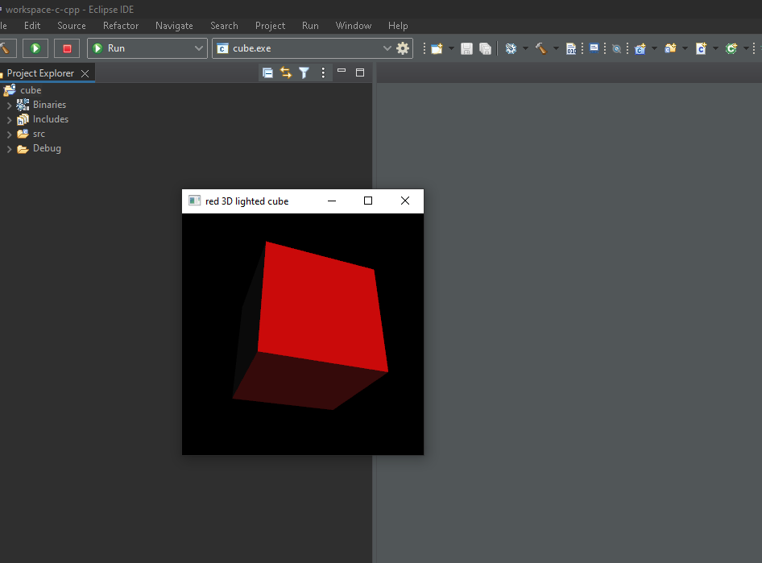
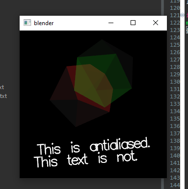
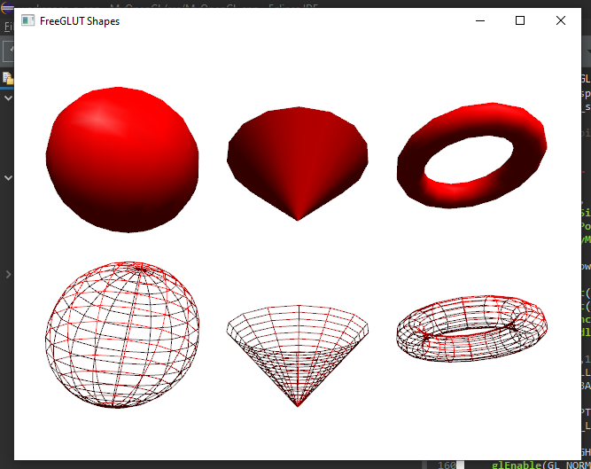

# A1 Report
Author: Nausher Rao
Date: 19/09/22

## Q1 Concepts of raster graphics (short answer)

### Q1.1 frame buffer
A frame buffer is a snapshot of a raster pattern that will be rendered to the display, that is stored somewhere in volatile memory - this usually being RAM or VRAM. Frame buffer's are useful if a GPU is powerful enough to generate more frames than can be rendered by the machine - instead of wasting the extra computational power, the frame can be stored in a frame buffer. A frame buffer usually stored one bit per pixel.

### Q1.2 pixel
A pixel is the smallest part of a display or image that can be meaningfully be interacted with. Pixels can be indivudually addressed as a value within a 2-dimensional matrix/array, and can be interacted with to change their red (r), green (g), blue (b), or alpha (a) values to display a specific colour.

### Q1.3 color depth
Color depth is the range of colours that can be displayed by each pixel. A high colour depth implies that more colours can be rendered per pixel, leading to more accurate or more saturated frames. Color depth is measured by how many bits are allocated to a single pixel, the standard being 24 bits for colour, and 8 bits for the alpha channel.

### Q1.4 resolution
The resolution of an image or display is the amount of pixels that can be displayed width-wise (number of pixels per scan line) and height-wise (amount of scan lines), with a higher resolution giving to a sharper image. Resolution is denoted as "width x height", the standard being 1920 x 1080.

## Q2 Concepts of raster display (short answer)

### Q2.1 scan line
A scan line is a single row of pixels in a raster scanning pattern - this can be a row of pixels on a CRT, or a computer monitor. On a CRT for example, the individual scan lines can be seen as the image is rendered one scan-line at a time.

### Q2.2 refreshment & refresh rate
The refresh rate of a display refers to the freqeuncy at which a new image is displayed - some common framerates being 24, 30, and 60 frames per second (fps). In older CRT monitors, the electron beam must constantly be refreshing pixels due to decay. A modern display is also constantly clearing the screen at a certain refresh rate.

### Q2.3 frame
A  frame is a fully rendered image/raster pattern on a display, which is shown for a very small amount of time before a new frame is rendered.

## Q3 Roles of CPU and GPU in CG (short answer)

### Q3.1 CPU roles
The CPU is responsible for sending the data neccessary for the GPU to calculate and render to the frame buffer. This data, for example, could be the data describing the vertices of a primitative geometric shape. The CPU communicated with the GPU over the PCI bus.

### Q3.2 GPU roles
The GPU is responsible for interacting directly with a frame buffer, which involves geometric, shader, and transformative calculations. Some example include drawing primitive graphical geometry, or calculating lighting.

## Q4 C/C++ OpenGL programming environment (lab practice)

### Q4.1 C/C++ OpenGL installation
Completed
{width=90%}

### Q4.2 OpenGL C project
Completed
{width=90%}

### Q4.3 OpenGL C++ project
Completed
{width=90%}

**References**

1. CP411 A1
