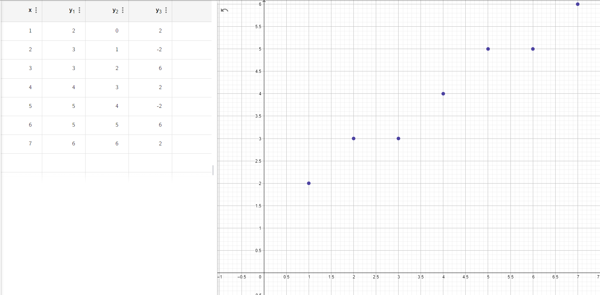
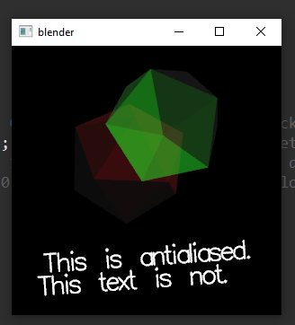
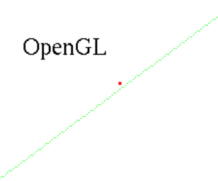
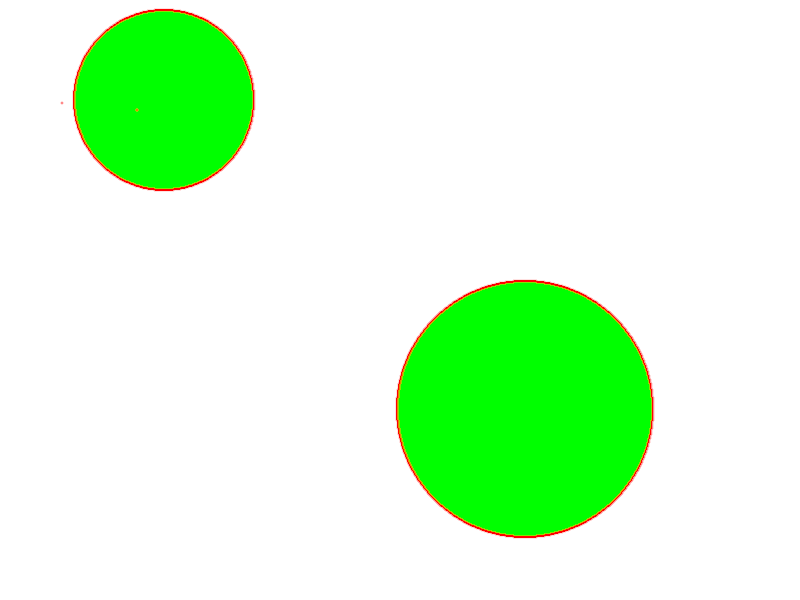
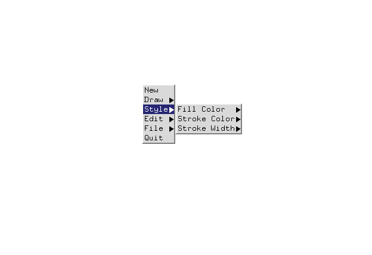
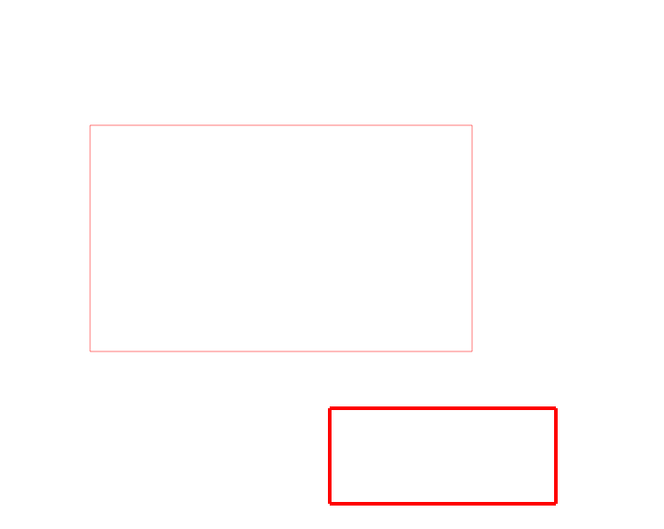
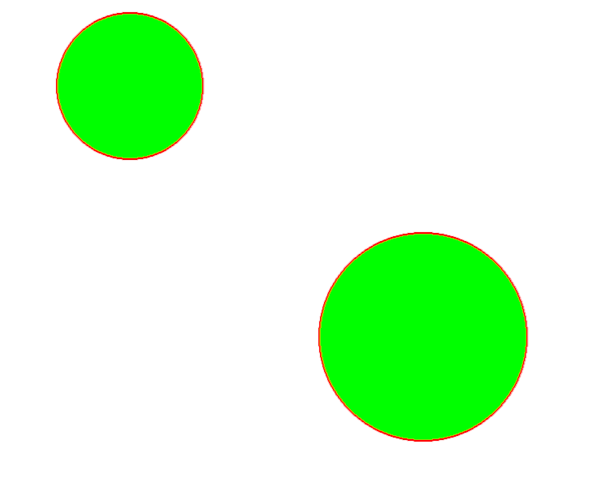
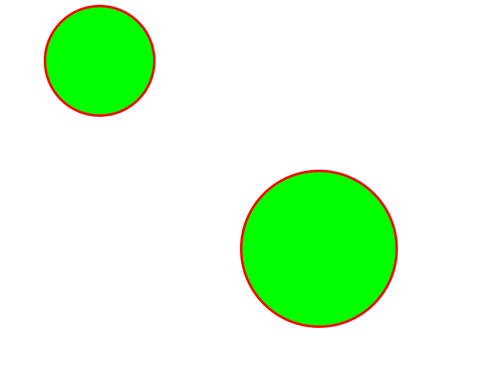
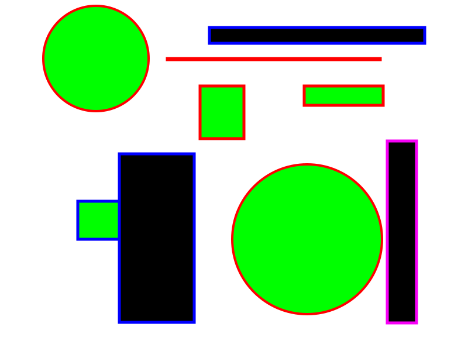
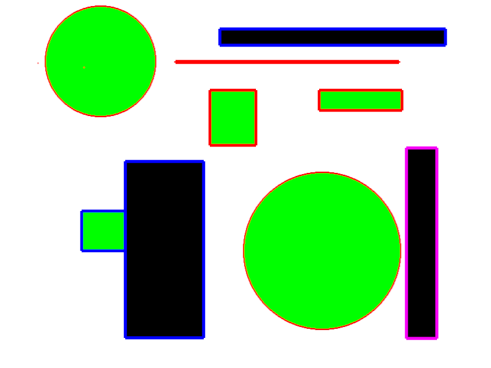

# A2 Report

Author: Nausher Rao

Date: 01/10/22

Check [readme.txt](readme.txt) for course work statement and self-evaluation.

## Q1 Graphics pipeline (short answer)

### Q1.1 Primitives
A graphics primitive are the most basic, essential, and barebones geometric shape elements that can be displayed on a screen. These are things that are native to OpenGL, and are non-interactive. These usually consist of lines, circles, arcs, rectangles, and dots.

### Q1.2 Coordinate systems & transformations
The view-point, world, object, and screen coordinate systems are involved with the graphics pipeline.

### Q1.3 Scan conversion
x and y1 represent the coordinates, y2 represents k, and y3 represents p_k.
{width=90%}

## Q2 OpenGL and Glut (lab practice)

### Q2.1 OpenGL primitives
Complete
{width=90%}

### Q2.2 Interactive graphics
Complete
{width=90%}

### Q2.3 Bitmap file I/O
Complete
{width=90%}

## Q3 SimpleDraw (programming)

### Q3.1 Display window and menu
Complete
{width=90%}

### Q3.2 Data structures
Complete
{width=90%}

### Q3.3 Draw rectangles
Complete
{width=90%}

### Q3.4 Draw circles
Complete
{width=90%}

### Q3.5 Edit features
Complete
{width=90%}

### Q3.6 Save/Open SVG files
Complete

### Q3.7 Export to bitmap
Complete
.

### Q3.8 Circle&Square artwork
Complete
, .

**References**
1. CP411 a2
