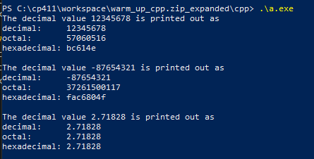

# A3 Report
Author: Nausher Rao
Date: 26/11/22
Check [readme.txt](readme.txt) for course work statement and self-evaluation.

## Q1 Graphics transformations (short_answer)
### Q1.1 Principle of transformations
1. Rotation, translation, scaling.
2. Set of transformations, one followed by the other, and work together to produce the desired effect.
3. Easier to perform rotation, translation, and scalling, as each can be represented by a matrix, which makes it easier to apply the transformations to objects.

### Q1.2 Hand on 2D transformations
{width=90%}

## Q2 Graphics transformation programming (lab practice)
### Q2.1 Warm up C++
{width=90%}

### Q2.2 2D transformations
{width=90%}

### Q2.3 3D object and transformations
{width=90%}

### Q2.4 Mesh object model
{width=90%}

## Q3 SimpleView1 - transformations (programming)
### Q3.1 Create and render cube objects
[Q 3.1](images/q3.1.png){width=90%}

### Q3.2 Create and render the pyramid object
[Q 3.2](images/q3.3.png){width=90%}

### Q3.3 Create and render the house object
[Q 3.3](images/q3.3.png){width=90%}

### Q3.4 MCS transforms
[Q 3.4](images/q3.4.png){width=90%}

### Q3.5 WCS transforms
[Q 3.5](images/q3.5.png){width=90%}

### Q3.6 VCS transforms
[Q 3.6](images/q3.6.png){width=90%}

**References**
1. CP411 a3
