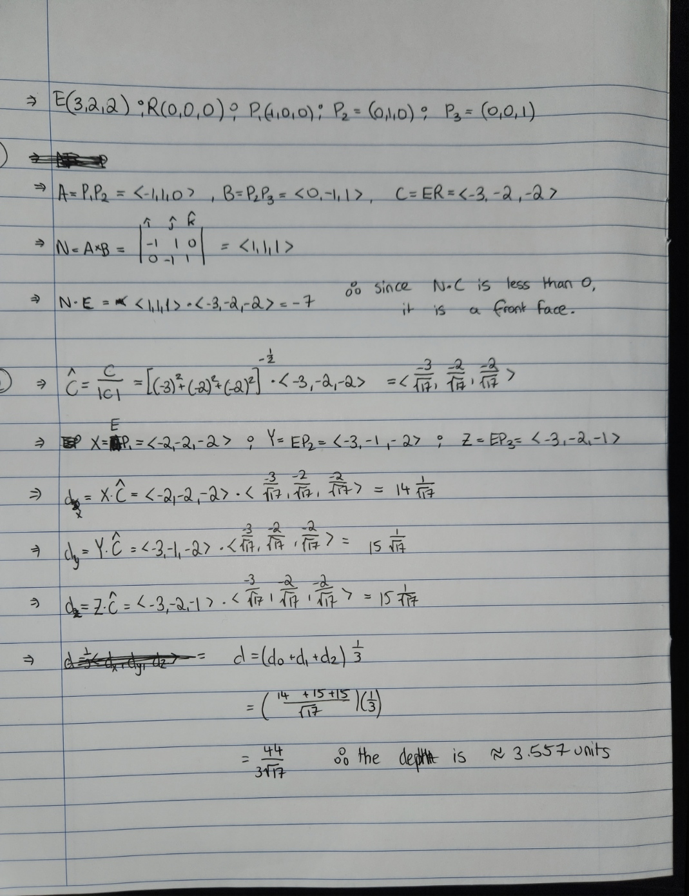
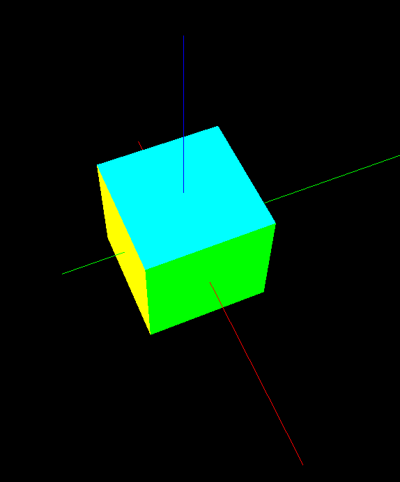
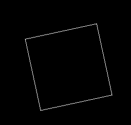
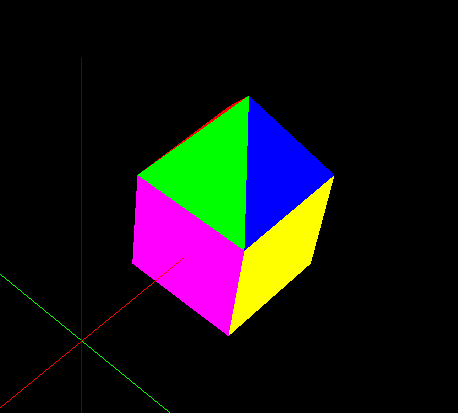
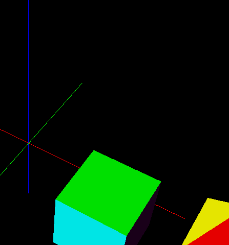
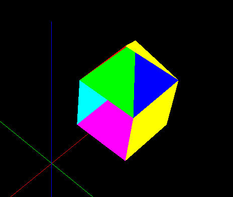
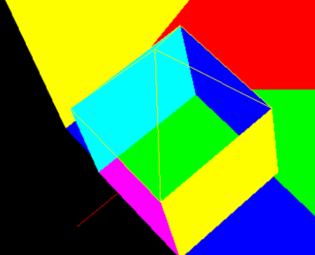

# A4 Report
Author: Nausher Rao
Date: 2022-11-09
Check [readme.txt](readme.txt) for course work statement and self-evaluation.

## Q1 Culling, Lighting, Shading (short_answer)
### Q1.1 Concepts of culling
1. Culling is a method of determining objects that visible to the camera, and removing the surfaces that aren’t visible. This is different to clipping, which is the method of not drawing primitives to the screen if they are out of the camera's view.

2. Object precision algorithms remove hidden surfaces with a lot of accuracy, but are computationally intense and might not be suitable for real-time rendering. An example of this is the z-buffer algorithm, which temporarily stores the depth of each pixel in a scene, and then determines which surfaces shouldn't be drawn. Image precision algorithms are faster and more efficient than object precision algorithms, but aren't as accurate. An example of an image precision algorithm is the painter's algorithm, which sorts surfaces in a scene by depth and draws surfaces in order of increasing importance (back-to-front). Overall, the differences are that image precision algorithms are faster and less accurate, while object precision algorithms are slower and more accurate. Image precision is based on the camera, using pixel depth of a line/point to determine whether or not to draw it, while Object precision takes into account geometrical relations of objects in the scene.

### Q1.2 Culling computing
{width=90%}

### Q1.3 Concepts of lighting and shading
1. A light source model determines the colour, position, direction, and intensity of the illumination model for a virtual light sources. Three different light source models are:
   1. Point - light coming from a point.
   2. Directional - light coming from a direction.
   3. Ambient - No source, reflected between surfaces.
2. A light reflection model determines how light sources are reflected by object surfaces to simulate reflection, which can change with colour, roughness, material type, and position from a light source. Three different reflection models are:
   1. Diffuse - reflection of a perfect rough surface.
   2. Specular - reflection off of a shiny surface.
   3. Ambient - ambient light reflected by nearby objects.
3. A shading model determines the pixel colour of a part of an object, the calculations depending on the amount shade of an object based off its reflection model. Three shading models are:
   1. Constant - Calculate the shade of a section of a polygon, and giving it to all parts.
   2. Gouraud - Calculate the shade of each vertex of a polygon.
   3. Phong - Calculating the normal of each vertex, which then gets the normal of a pixel in the polygon, which is then applied as the shade colour of that pixel.

### Q1.4 Lighting computing
{width=90%}

## Q2 OpenGL culling, lighting, shading (lab practice)
### Q2.1 Hidden surface removal
{width=90%}

### Q2.2 Lighting and Shading
{width=90%}

### Q2.3 Animation
{width=90%}

## Q3 SimpleView2 - culling, lighting, shading (programming)
### Q3.1 Culling
{width=90%}

### Q3.2 Lighting
{width=90%}

### Q3.3 Shading
{width=90%}

### Q3.4 Animations
{width=90%}

**References**
1. CP411 a4
