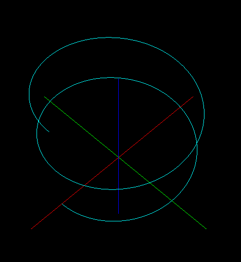
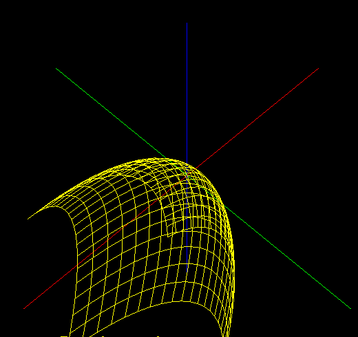

# A5 Report
Author: Nausher Rao
Date: 2022-11-23
Check [readme.txt](readme.txt) for course work statement and self-evaluation.

## Q1 Curve and surface computing (short_answer)
### Q1.1 Cubic spline computing
{width=90%}

### Q1.2 Rotation surface and normal
{width=90%}

## Q2 Curve, surface, texture, GLSL (lab practice)
### Q2.1 Curve model and rendering
{width=90%}

### Q2.2 Surface model and rendering
{width=90%}

### Q2.3 Texture mapping
{width=90%}

### Q2.4 GPU programming by GLSL
{width=90%}
{width=90%}

## Q3 SimpleView3 - texture, GLSL, curve, and surface (programming)
### Q3.1 Texture mapping basics
[Q 3.1](images/q3.1.png){width=90%}

### Q3.2 Solar system with texture mapping
[Q 3.2](images/q3.2.png){width=90%}

### Q3.3 Bezier curve
[Q 3.3](images/demo.png){width=90%}

### Q3.4 Rotation surface of Bezier curve
[Q 3.4](images/demo.png){width=90%}

### Q3.5 Phong shading by GLSL
[Q 3.5](images/demo.png){width=90%}

### Q3.6 My Graphics Library
[Q 3.6](images/demo.png){width=90%}

**References**
1. CP411 a5
